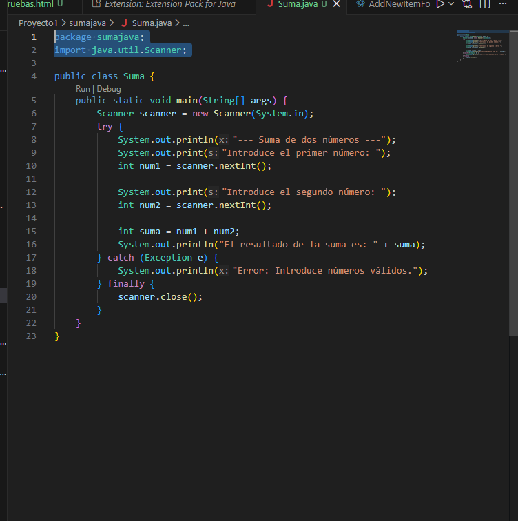
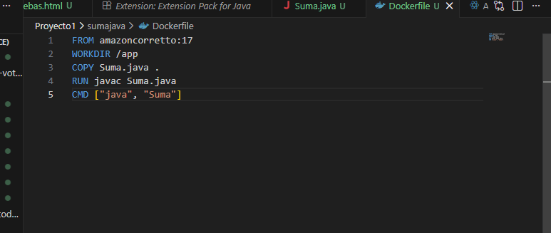
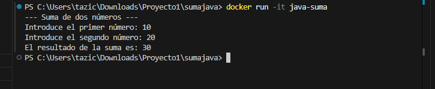

1.Creamos el archivo Suma.java antes de eso instalamos una extension que nos permita usar java en visual como Extension Pack for Java y ya rellenamos una para que sirva de suma en Suma.java.

2.Creamos en la misma carpeta de Suma.java creamos un Dockerfile donde

-From representa el comienzo ya que es donde estara el java instalado.

-WORKDIR es para ordenar e indica que queremos crear una carpeta llamada app.

-COPY sirve para coger el archivo que selecionemos por ejemplo en nuestro caso Suma.java y el punto final es para indicar donde (/app)

-RUN compilamos el archivo que ya tenemos

-CMD cuando alguien arranque este contenedor ejecuta este comando

3.dockerizamos es decir hacemos la reconstrucion de la imagen con  
docker build -t java-suma .

4.ejecutamos el contenedor con este comando docker run -it java-suma
